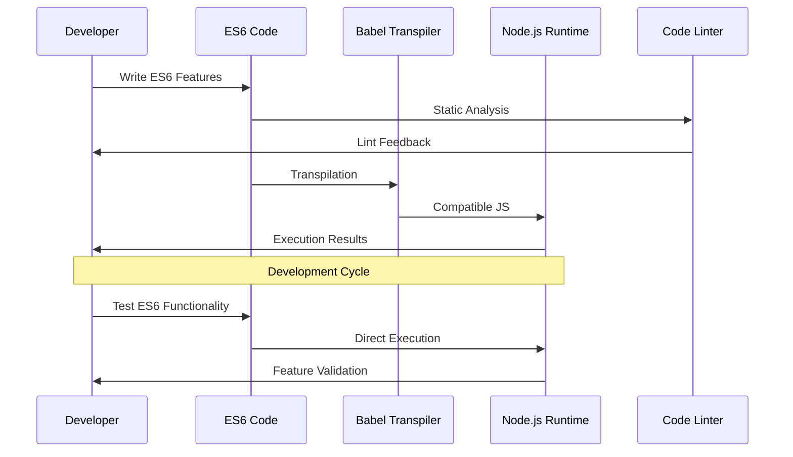
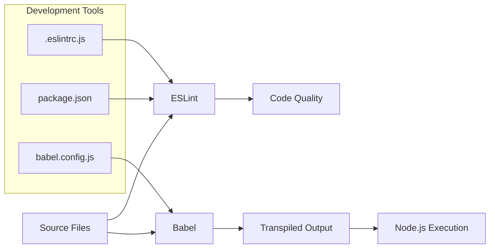
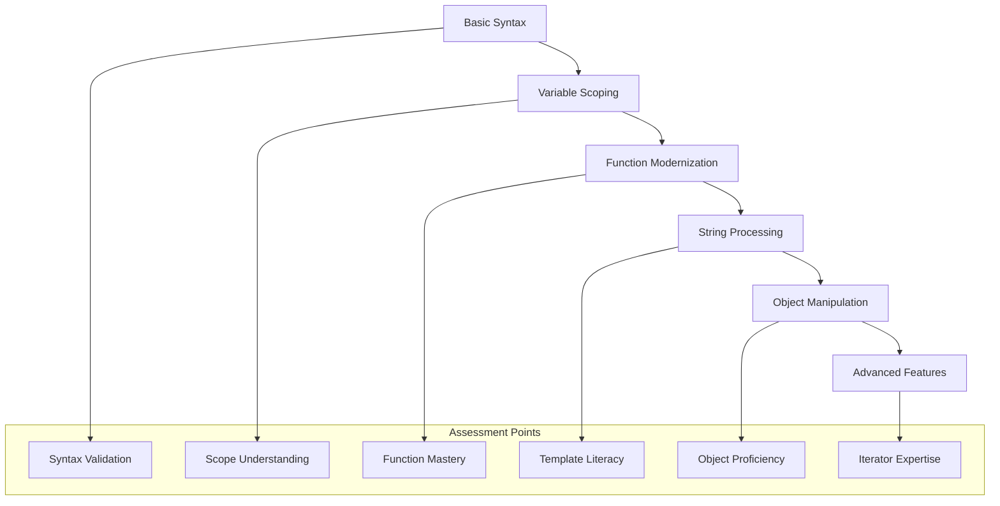
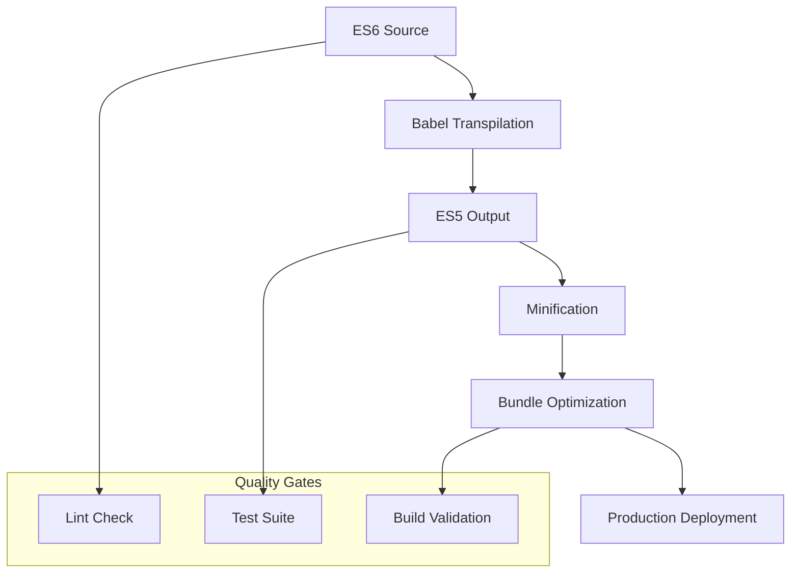

# 🏗️ System Architecture

## 📖 Overview
This project implements a comprehensive ES6 (ECMAScript 2015) learning architecture focused on modern JavaScript fundamentals. The architecture demonstrates progressive skill development from basic variable declarations to advanced features like destructuring, template literals, and iterators, establishing the foundation for modern JavaScript development and backend engineering.

---

## 🏛️ High-Level Architecture

```mermaid
graph TD
    A[ES6 Core Features] --> B[Variable Management]
    A --> C[Function Enhancements]
    A --> D[String Processing]
    A --> E[Object Manipulation]
    A --> F[Control Flow]
    
    subgraph "Foundation Layer"
        G[const/let declarations]
        H[Block scoping]
        I[Temporal dead zone]
    end
    
    subgraph "Function Layer"
        J[Arrow functions]
        K[Default parameters]
        L[Rest parameters]
        M[Spread operator]
    end
    
    subgraph "Data Processing Layer"
        N[Template literals]
        O[Object shorthand]
        P[Destructuring]
        Q[Computed properties]
    end
    
    subgraph "Advanced Features"
        R[for...of loops]
        S[Iterators]
        T[Object creation]
        U[Method definitions]
    end
    
    B --> G
    B --> H
    B --> I
    
    C --> J
    C --> K
    C --> L
    C --> M
    
    D --> N
    E --> O
    E --> P
    E --> Q
    
    F --> R
    F --> S
    F --> T
    F --> U
```

The architecture follows a progressive learning model where each layer builds upon ES6 fundamentals while introducing increasingly sophisticated language features.

---

## 🧩 Core Components

### Variable Declaration System
- **Purpose**: Implement modern JavaScript variable management with proper scoping
- **Technology**: ES6 const/let declarations, block scoping
- **Location**: `0-constants.js`, `1-block-scoped.js`
- **Responsibilities**:
  - Demonstrate const vs let usage patterns
  - Implement block-scoped variable declarations
  - Show temporal dead zone behavior
  - Prevent variable reassignment violations
- **Interfaces**: Console output, variable scope demonstrations

### Function Enhancement Layer
- **Purpose**: Modern function syntax and parameter handling
- **Technology**: Arrow functions, default parameters, rest/spread operators
- **Location**: `2-arrow.js`, `3-default-parameter.js`, `4-rest-parameter.js`, `5-spread-operator.js`
- **Responsibilities**:
  - Arrow function implementation and context binding
  - Default parameter value assignment
  - Rest parameter array collection
  - Spread operator for array/object manipulation
- **Interfaces**: Function calls, parameter passing, return values

### String Processing Module
- **Purpose**: Advanced string manipulation using ES6 template literals
- **Technology**: Template literals, expression interpolation
- **Location**: `6-string-interpolation.js`
- **Responsibilities**:
  - Dynamic string construction with embedded expressions
  - Multi-line string handling
  - Variable and function call interpolation
  - String formatting and templating
- **Interfaces**: String output, expression evaluation

### Object Management System
- **Purpose**: Modern object creation and manipulation techniques
- **Technology**: Object shorthand, computed properties, method definitions
- **Location**: `7-getBudgetObject.js`, `8-getBudgetCurrentYear.js`, `9-getFullBudget.js`
- **Responsibilities**:
  - Object property shorthand notation
  - Computed property names with expressions
  - ES6 method definition syntax
  - Dynamic object property creation
- **Interfaces**: Object creation, property access, method invocation

### Data Structure Processing
- **Purpose**: Advanced data manipulation and iteration patterns
- **Technology**: for...of loops, destructuring, object creation
- **Location**: `10-loops.js`, `11-createEmployeesObject.js`, `12-createReportObject.js`
- **Responsibilities**:
  - for...of loop implementation for iterables
  - Object creation from array data
  - Complex object structure generation
  - Data transformation and aggregation
- **Interfaces**: Array processing, object transformation

### Iterator and Advanced Features
- **Purpose**: Implement ES6 iterator protocol and advanced object manipulation
- **Technology**: Iterators, generator functions, Symbol.iterator
- **Location**: `100-createIteratorObject.js`, `101-iterateThroughObject.js`
- **Responsibilities**:
  - Custom iterator object creation
  - Iterator protocol implementation
  - Object property iteration
  - Advanced traversal patterns
- **Interfaces**: Iterator objects, traversal methods

---

## 📊 Data Flow Architecture

---

## 🔧 Development Environment Architecture

### Build System Components

### Configuration Management
- **Package Management**: npm with development dependencies
- **Transpilation**: Babel with ES6 preset for compatibility
- **Code Quality**: ESLint with Airbnb configuration
- **Testing**: Jest framework for unit testing
- **Development Server**: Babel-node for ES6 execution

---

## 🎯 Learning Progression Architecture

### Skill Development Pipeline

### Competency Layers
1. **Foundation**: Variable declarations and scoping rules
2. **Functions**: Arrow functions and parameter enhancements
3. **Strings**: Template literals and interpolation
4. **Objects**: Modern object creation and manipulation
5. **Iteration**: Advanced looping and iterator patterns
6. **Integration**: Combining multiple ES6 features

---

## 🔍 Code Quality Architecture

### Static Analysis Pipeline
- **Linting**: ESLint with Airbnb style guide
- **Format Checking**: Consistent code formatting
- **Syntax Validation**: ES6 syntax correctness
- **Best Practices**: Modern JavaScript patterns

### Testing Framework
- **Unit Testing**: Jest framework for individual feature testing
- **Integration Testing**: Combined feature validation
- **Manual Testing**: Interactive execution with main files
- **Automated Testing**: npm script automation

---

## 📈 Performance Considerations

### ES6 Feature Optimization
- **Const vs Let**: Proper variable declaration for performance
- **Arrow Functions**: Lexical binding optimization
- **Template Literals**: Efficient string construction
- **Spread Operator**: Memory-efficient array/object operations
- **for...of Loops**: Optimized iteration patterns

### Development Optimization
- **Babel Transpilation**: Browser compatibility without performance loss
- **Tree Shaking**: Unused code elimination
- **Module Bundling**: Efficient code organization
- **Hot Reloading**: Fast development iteration

---

## 🔒 Code Security Patterns

### ES6 Security Features
- **Block Scoping**: Variable isolation and security
- **Const Declarations**: Immutable reference protection
- **Template Literals**: XSS prevention in string construction
- **Strict Mode**: Enhanced error detection

### Development Security
- **Dependency Management**: Secure npm package handling
- **Code Linting**: Security pattern enforcement
- **Input Validation**: Safe data processing patterns
- **Error Handling**: Secure error reporting

---

## 🚀 Deployment Architecture

### Production Readiness

### Compatibility Strategy
- **Browser Support**: ES5 fallback through Babel
- **Node.js Compatibility**: Native ES6 support
- **Legacy Support**: Polyfill integration
- **Progressive Enhancement**: Feature detection and fallbacks

---

## 📚 Educational Architecture

### Learning Path Design
- **Sequential Learning**: Progressive feature introduction
- **Hands-on Practice**: Practical implementation exercises
- **Real-world Applications**: Industry-relevant examples
- **Skill Assessment**: Measurable learning outcomes

### Knowledge Validation
- **Code Reviews**: Peer and mentor feedback
- **Testing Requirements**: Automated validation
- **Documentation**: Comprehensive explanation requirements
- **Portfolio Building**: Career-ready code samples

---

## 🔄 Maintenance and Evolution

### Code Maintenance
- **Version Control**: Git-based change tracking
- **Documentation**: Comprehensive inline and external docs
- **Refactoring**: Continuous code improvement
- **Dependency Updates**: Regular security and feature updates

### Curriculum Evolution
- **Feature Updates**: Latest ES6+ feature integration
- **Industry Alignment**: Current development practice integration
- **Feedback Integration**: Student and industry feedback incorporation
- **Technology Advancement**: Modern tooling and best practices

---

*This architecture provides a comprehensive foundation for ES6 JavaScript mastery, preparing students for modern web development and backend engineering roles through systematic skill development and industry best practices.*
