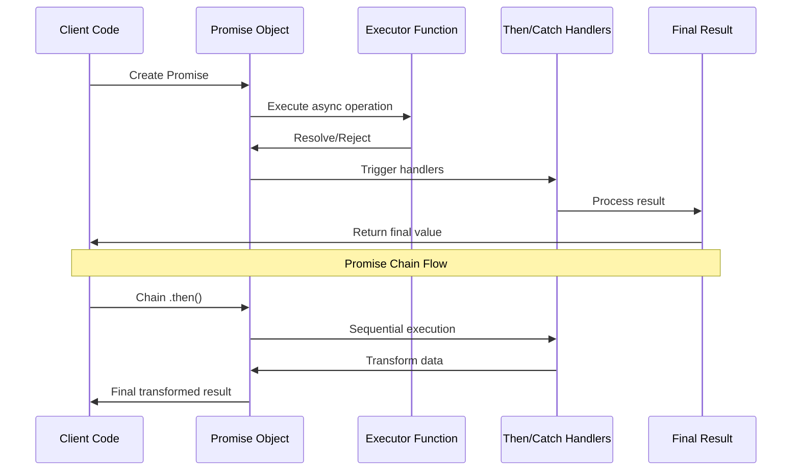
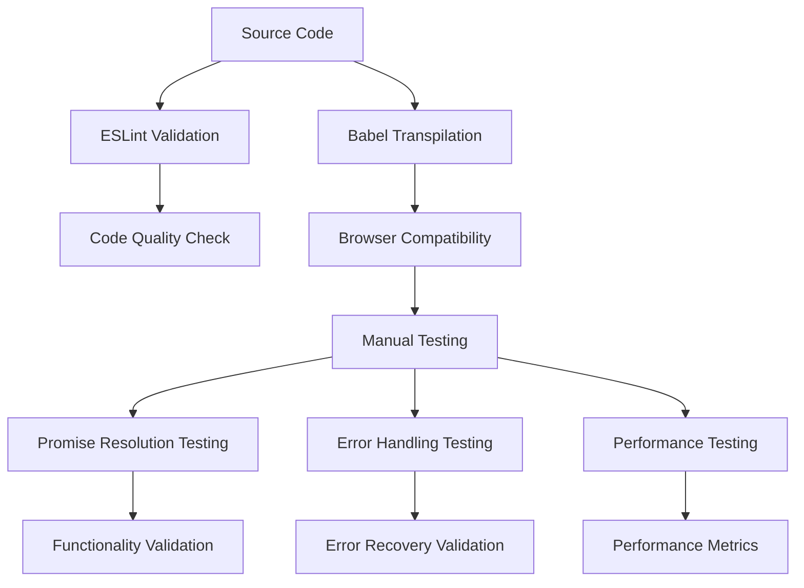
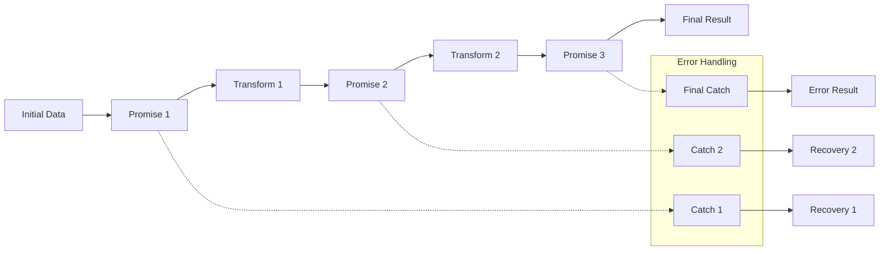
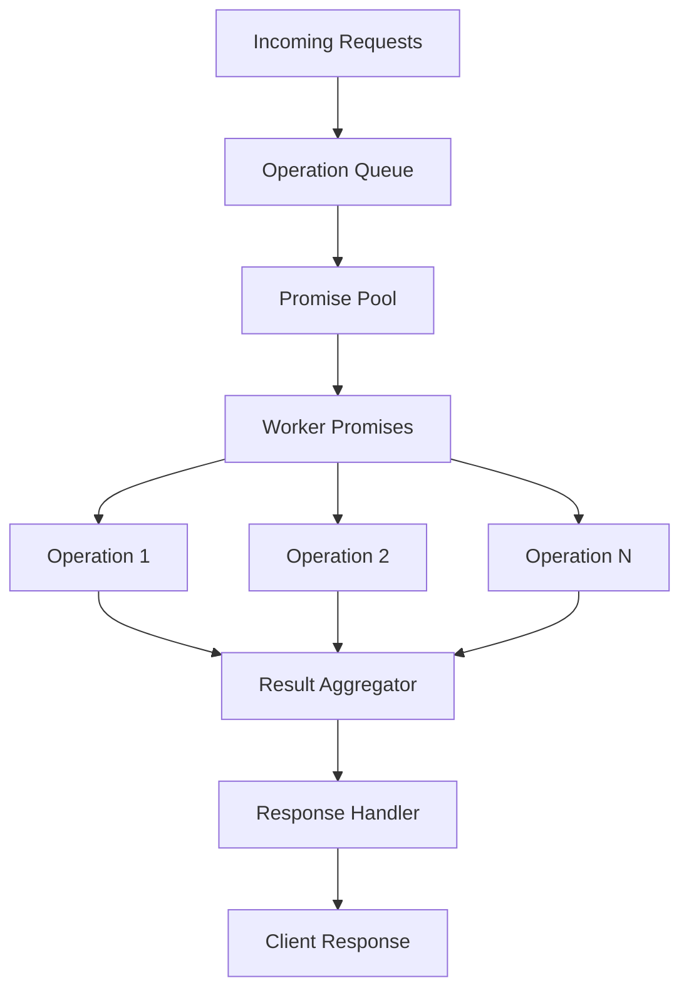
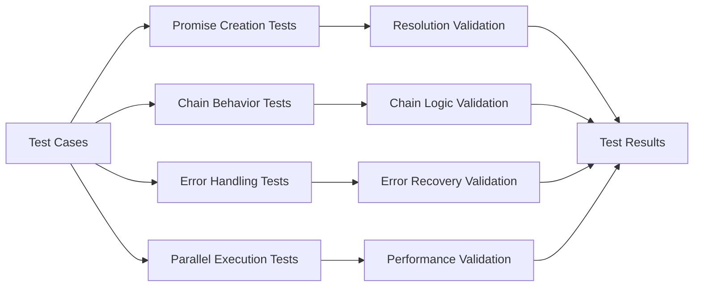
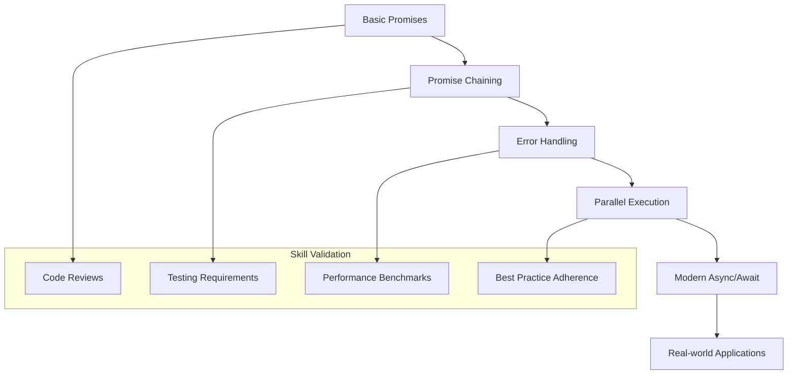

# 🏗️ System Architecture

## 📖 Overview
This project implements a comprehensive asynchronous JavaScript programming architecture focused on ES6 Promises and modern async/await patterns. The architecture demonstrates progressive skill development from basic Promise creation to advanced error handling, parallel execution, and real-world asynchronous programming patterns essential for backend development.

---

## 🏛️ High-Level Architecture

```mermaid
graph TD
    A[Asynchronous Programming] --> B[Promise Fundamentals]
    A --> C[Promise Chaining]
    A --> D[Error Handling]
    A --> E[Parallel Execution]
    A --> F[Modern Async/Await]
    
    subgraph "Foundation Layer"
        G[Promise Creation]
        H[Basic Resolution]
        I[Rejection Handling]
    end
    
    subgraph "Composition Layer"
        J[Promise Chaining]
        K[Transformation Methods]
        L[Sequential Operations]
    end
    
    subgraph "Error Management"
        M[Try/Catch Blocks]
        N[Promise.catch()]
        O[Error Propagation]
    end
    
    subgraph "Parallel Processing"
        P[Promise.all()]
        Q[Promise.race()]
        R[Load Balancing]
    end
    
    subgraph "Modern Syntax"
        S[Async Functions]
        T[Await Operations]
        U[Error Handling]
    end
    
    B --> G
    B --> H
    B --> I
    
    C --> J
    C --> K
    C --> L
    
    D --> M
    D --> N
    D --> O
    
    E --> P
    E --> Q
    E --> R
    
    F --> S
    F --> T
    F --> U
```

The architecture follows a progressive learning model where each layer builds upon asynchronous programming fundamentals while introducing increasingly sophisticated Promise patterns.

---

## 🧩 Core Components

### Promise Foundation Layer
- **Purpose**: Establish fundamental Promise creation and handling patterns
- **Technology**: ES6 Promise constructor, resolve/reject mechanisms
- **Location**: `0-promise.js`, `1-promise.js`
- **Responsibilities**:
  - Promise object creation and initialization
  - Basic resolution and rejection handling
  - Promise state management (pending, fulfilled, rejected)
  - Asynchronous operation encapsulation
- **Interfaces**: Promise objects, callback functions, state transitions

### Promise Composition System
- **Purpose**: Implement Promise chaining and transformation patterns
- **Technology**: Promise.then(), transformation functions, method chaining
- **Location**: `2-then.js`
- **Responsibilities**:
  - Promise method chaining implementation
  - Data transformation through Promise chains
  - Sequential asynchronous operation handling
  - Value passing between Promise stages
- **Interfaces**: Chained Promise methods, transformation functions

### Parallel Execution Engine
- **Purpose**: Manage multiple concurrent asynchronous operations
- **Technology**: Promise.all(), Promise.race(), concurrent execution patterns
- **Location**: `3-all.js`, `7-load_balancer.js`
- **Responsibilities**:
  - Parallel Promise execution and coordination
  - Load balancing between multiple async operations
  - Result aggregation from concurrent operations
  - Performance optimization through parallelization
- **Interfaces**: Promise arrays, aggregated results, performance metrics

### User Management System
- **Purpose**: Demonstrate real-world Promise usage in user operations
- **Technology**: Simulated API calls, user data processing, validation
- **Location**: `4-user-promise.js`, `6-final-user.js`
- **Responsibilities**:
  - User profile creation and validation
  - Asynchronous user data processing
  - Profile photo upload and processing
  - User workflow orchestration
- **Interfaces**: User objects, profile data, validation results

### Error Handling Framework
- **Purpose**: Comprehensive error management in asynchronous operations
- **Technology**: Promise.catch(), try/catch blocks, error propagation
- **Location**: `5-photo-reject.js`, `8-try.js`, `9-try.js`
- **Responsibilities**:
  - Graceful error handling and recovery
  - Error propagation through Promise chains
  - Custom error creation and management
  - Fallback mechanisms for failed operations
- **Interfaces**: Error objects, recovery functions, fallback values

### Modern Async/Await Layer
- **Purpose**: Implement modern asynchronous programming patterns
- **Technology**: async/await syntax, modern error handling
- **Location**: `100-await.js`
- **Responsibilities**:
  - Synchronous-style asynchronous code writing
  - Modern error handling with try/catch
  - Clean, readable asynchronous code patterns
  - Integration with existing Promise-based systems
- **Interfaces**: Async functions, await expressions, modern syntax

---

## 🔄 Asynchronous Flow Architecture



---

## 🎯 Error Handling Architecture

### Error Management Pipeline
```mermaid
graph TB
    A[Async Operation] --> B{Operation Status}
    B -->|Success| C[Promise Resolution]
    B -->|Error| D[Promise Rejection]
    
    C --> E[.then() Handler]
    D --> F[.catch() Handler]
    
    E --> G[Data Transformation]
    F --> H[Error Recovery]
    
    G --> I[Next Promise Chain]
    H --> J[Fallback Value]
    
    I --> K[Final Result]
    J --> K
    
    subgraph "Error Types"
        L[Network Errors]
        M[Validation Errors]
        N[System Errors]
        O[Custom Errors]
    end
    
    D --> L
    D --> M
    D --> N
    D --> O
```

### Error Recovery Strategies
- **Graceful Degradation**: Fallback values for failed operations
- **Retry Mechanisms**: Automatic retry for transient failures
- **Error Propagation**: Controlled error bubbling through Promise chains
- **Custom Error Types**: Specific error handling for different failure modes

---

## 🚀 Performance Optimization Architecture

### Parallel Processing Patterns
```mermaid
graph LR
    A[Multiple Async Operations] --> B[Promise.all()]
    A --> C[Promise.race()]
    A --> D[Custom Load Balancer]
    
    B --> E[All Results Aggregated]
    C --> F[First Result Wins]
    D --> G[Optimized Distribution]
    
    subgraph "Performance Benefits"
        H[Reduced Latency]
        I[Higher Throughput]
        J[Resource Optimization]
    end
    
    E --> H
    F --> I
    G --> J
```

### Optimization Strategies
- **Concurrent Execution**: Multiple operations running in parallel
- **Load Balancing**: Distributing operations across available resources
- **Early Termination**: Using Promise.race() for timeout scenarios
- **Resource Pooling**: Efficient resource utilization patterns

---

## 🔧 Development Environment Architecture

### Testing and Validation Framework


### Development Tools Integration
- **ESLint**: Code quality and style enforcement
- **Babel**: ES6+ to ES5 transpilation for compatibility
- **Node.js**: Server-side JavaScript execution environment
- **Manual Testing**: Interactive Promise behavior validation

---

## 📊 Data Flow Patterns

### Promise Chain Data Transformation


### Async/Await Data Flow
- **Sequential Processing**: Linear data transformation with await
- **Error Boundaries**: Try/catch blocks for error containment
- **Clean Syntax**: Synchronous-style asynchronous code
- **Integration**: Seamless integration with Promise-based APIs

---

## 🔒 Security Considerations

### Asynchronous Security Patterns
- **Timeout Management**: Preventing hanging operations with timeouts
- **Error Information Leakage**: Secure error handling without exposing internals
- **Resource Exhaustion**: Controlling concurrent operation limits
- **Input Validation**: Validating data before asynchronous processing

### Security Best Practices
- **Promise Rejection Handling**: Always handle Promise rejections
- **Timeout Implementation**: Set reasonable timeouts for all async operations
- **Error Sanitization**: Clean error messages for client consumption
- **Resource Limits**: Implement limits on concurrent operations

---

## 📈 Scalability Architecture

### Concurrent Operation Management


### Scalability Patterns
- **Promise Pooling**: Reusing Promise resources for efficiency
- **Queue Management**: Handling high volumes of async operations
- **Result Aggregation**: Efficiently combining multiple operation results
- **Load Distribution**: Spreading operations across available resources

---

## 🧪 Testing Architecture

### Promise Testing Framework


### Testing Strategies
- **Unit Testing**: Individual Promise function validation
- **Integration Testing**: Promise chain behavior testing
- **Error Testing**: Error handling and recovery validation
- **Performance Testing**: Parallel execution efficiency measurement

---

## 🔄 Deployment and Integration

### Production Readiness
- **Error Monitoring**: Comprehensive async operation monitoring
- **Performance Metrics**: Async operation performance tracking
- **Logging**: Detailed Promise execution logging
- **Health Checks**: Async operation health monitoring

### Integration Patterns
- **API Integration**: Promise-based API client implementation
- **Database Operations**: Async database interaction patterns
- **File Operations**: Asynchronous file system operations
- **Network Operations**: Promise-based network communication

---

## 📚 Educational Progression

### Learning Path Architecture


### Competency Development
- **Foundation**: Promise creation and basic handling
- **Intermediate**: Chaining, error handling, and composition
- **Advanced**: Parallel processing and performance optimization
- **Expert**: Modern syntax and real-world application patterns

---

*This architecture provides a comprehensive foundation for asynchronous JavaScript programming, preparing students for modern backend development roles through systematic skill development and industry best practices.*
