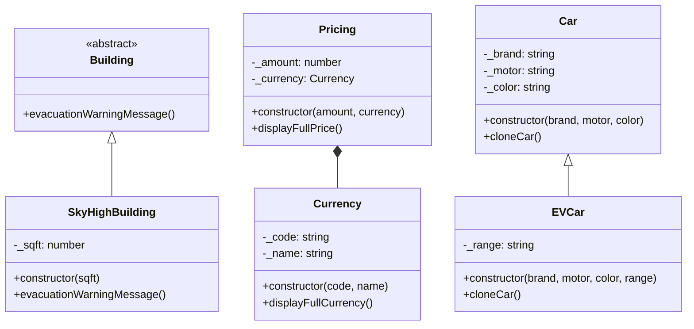
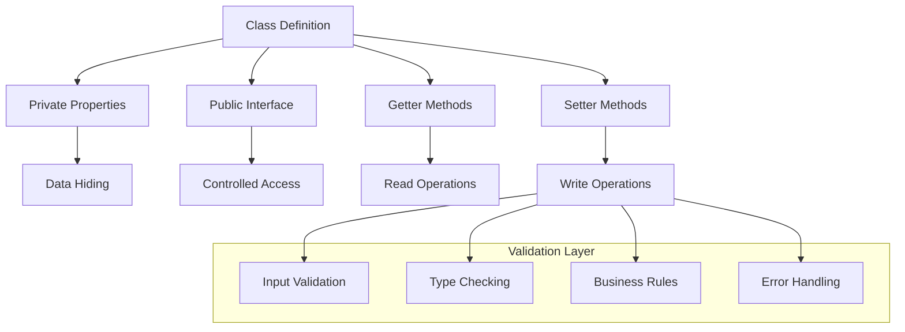
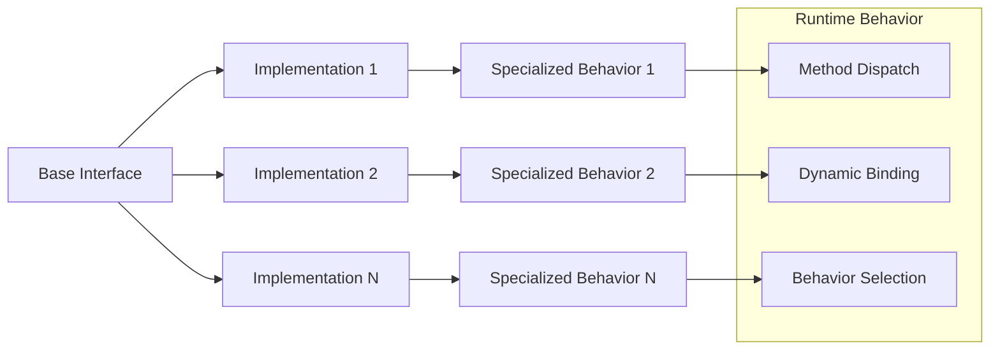
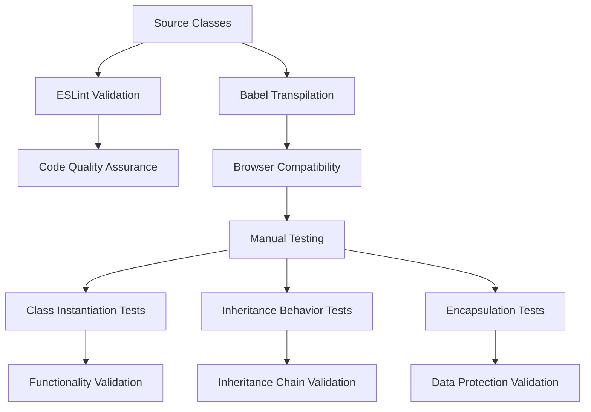
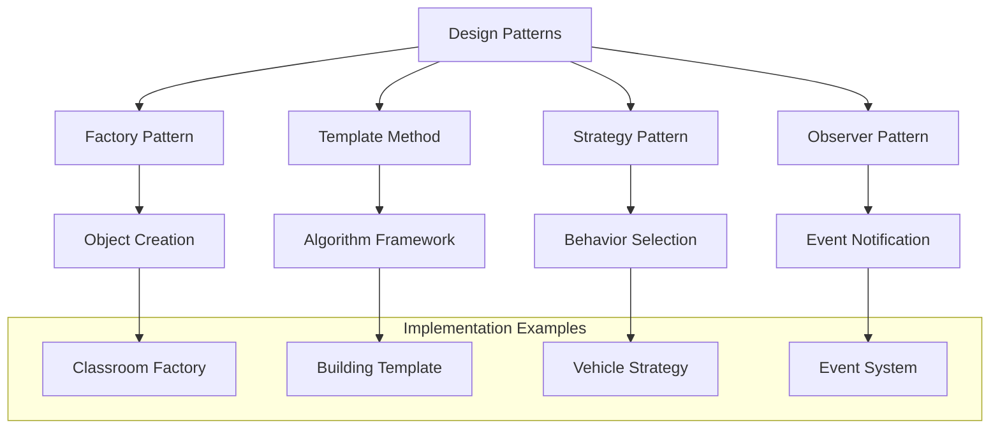
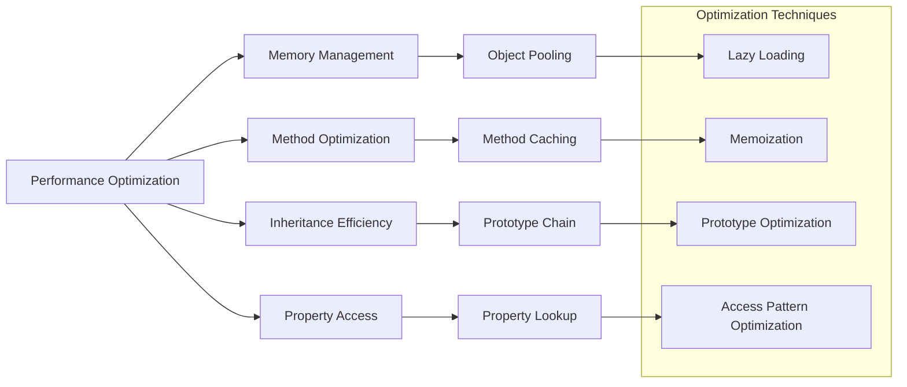
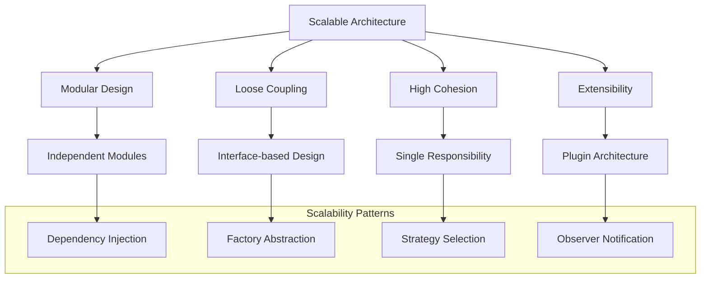
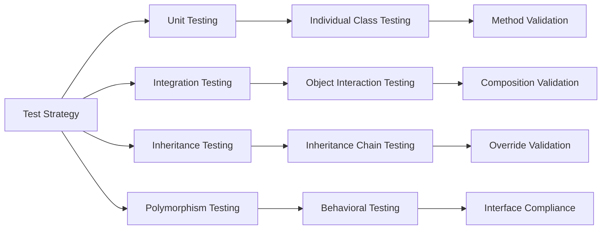

# 🏗️ System Architecture

## 📖 Overview
This project implements a comprehensive Object-Oriented Programming (OOP) architecture using ES6 classes in JavaScript. The architecture demonstrates progressive skill development from basic class creation to advanced inheritance patterns, encapsulation, and polymorphism, establishing the foundation for scalable backend application development and enterprise-level software design.

---

## 🏛️ High-Level Architecture

```mermaid
graph TD
    A[Object-Oriented Programming] --> B[Class Fundamentals]
    A --> C[Inheritance Hierarchy]
    A --> D[Encapsulation Patterns]
    A --> E[Polymorphism Implementation]
    A --> F[Advanced OOP Concepts]
    
    subgraph "Foundation Layer"
        G[Basic Class Definition]
        H[Constructor Methods]
        I[Instance Properties]
        J[Method Implementation]
    end
    
    subgraph "Inheritance Layer"
        K[Parent-Child Relationships]
        L[Method Overriding]
        M[Super Constructor Calls]
        N[Protected Members]
    end
    
    subgraph "Encapsulation Layer"
        O[Private Properties]
        P[Getter/Setter Methods]
        Q[Access Control]
        R[Data Validation]
    end
    
    subgraph "Polymorphism Layer"
        S[Abstract Classes]
        T[Interface Implementation]
        U[Method Overriding]
        V[Dynamic Behavior]
    end
    
    subgraph "Advanced Features"
        W[Static Methods]
        X[Class Expressions]
        Y[Mixins]
        Z[Metaprogramming]
    end
    
    B --> G
    B --> H
    B --> I
    B --> J
    
    C --> K
    C --> L
    C --> M
    C --> N
    
    D --> O
    D --> P
    D --> Q
    D --> R
    
    E --> S
    E --> T
    E --> U
    E --> V
    
    F --> W
    F --> X
    F --> Y
    F --> Z
```



The architecture follows a layered approach where each layer builds upon object-oriented programming fundamentals while introducing increasingly sophisticated design patterns.

---

## 🧩 Core Components

### Class Foundation System
- **Purpose**: Establish fundamental class creation and instantiation patterns
- **Technology**: ES6 class syntax, constructor methods, instance properties
- **Location**: `0-classroom.js`, `1-make_classrooms.js`
- **Responsibilities**:
  - Basic class definition and structure
  - Constructor method implementation
  - Instance property initialization
  - Object instantiation and method invocation
- **Interfaces**: Class constructors, instance methods, property access

### Educational Domain Models
- **Purpose**: Implement real-world educational system modeling
- **Technology**: Class inheritance, method implementation, data validation
- **Location**: `2-hbtn_course.js`, `0-classroom.js`, `1-make_classrooms.js`
- **Responsibilities**:
  - Course and classroom entity modeling
  - Educational data structure representation
  - Business logic implementation for educational systems
  - Validation of educational entity properties
- **Interfaces**: Educational entity creation, property manipulation, validation methods

### Financial System Architecture
- **Purpose**: Demonstrate complex business domain modeling with OOP
- **Technology**: Class composition, inheritance, encapsulation patterns
- **Location**: `3-currency.js`, `4-pricing.js`
- **Responsibilities**:
  - Currency representation and manipulation
  - Pricing model implementation with currency support
  - Financial calculation methods and validation
  - Complex object composition patterns
- **Interfaces**: Currency objects, pricing calculations, financial operations

### Inheritance Hierarchy Framework
- **Purpose**: Implement advanced inheritance patterns and abstract classes
- **Technology**: Class inheritance, abstract methods, method overriding
- **Location**: `5-building.js`, `6-sky_high.js`
- **Responsibilities**:
  - Abstract base class definition
  - Concrete class implementation with inheritance
  - Method overriding and polymorphic behavior
  - Template method pattern implementation
- **Interfaces**: Abstract interfaces, concrete implementations, polymorphic methods

### Infrastructure Modeling System
- **Purpose**: Model real-world infrastructure with OOP principles
- **Technology**: Class design, encapsulation, toString implementations
- **Location**: `7-airport.js`, `8-hbtn_class.js`
- **Responsibilities**:
  - Airport and infrastructure entity modeling
  - Custom string representation implementation
  - Encapsulation of infrastructure properties
  - Real-world entity behavior simulation
- **Interfaces**: Infrastructure objects, string representations, property access

### Advanced OOP Patterns
- **Purpose**: Implement sophisticated OOP concepts and patterns
- **Technology**: Hoisting, static methods, advanced inheritance
- **Location**: `9-hoisting.js`, `10-car.js`, `100-evcar.js`
- **Responsibilities**:
  - JavaScript hoisting behavior with classes
  - Vehicle hierarchy with inheritance patterns
  - Electric vehicle specialization and method overriding
  - Advanced polymorphic behavior implementation
- **Interfaces**: Vehicle objects, specialized behaviors, inheritance chains

---

## 🔄 Object Lifecycle Architecture

```mermaid
sequenceDiagram
    participant Client as Client Code
    participant Constructor as Class Constructor
    participant Instance as Object Instance
    participant Methods as Instance Methods
    participant Properties as Object Properties

    Client->>Constructor: new ClassName()
    Constructor->>Properties: Initialize properties
    Constructor->>Instance: Create instance
    Instance->>Client: Return object reference
    
    Note over Client,Properties: Object Usage
    Client->>Methods: Call instance methods
    Methods->>Properties: Access/modify properties
    Properties->>Methods: Return values
    Methods->>Client: Return results
    
    Note over Client,Properties: Inheritance Chain
    Client->>Instance: Call inherited method
    Instance->>Methods: Lookup method in prototype chain
    Methods->>Client: Execute inherited behavior
```

---

## 🏗️ Inheritance Architecture

### Class Hierarchy Design


### Inheritance Patterns
- **Abstract Base Classes**: Template definitions with abstract methods
- **Concrete Implementations**: Full method implementations in derived classes
- **Method Overriding**: Specialized behavior in child classes
- **Super Constructor Calls**: Proper initialization chain management

---

## 🔒 Encapsulation Architecture

### Data Protection Strategies


### Encapsulation Features
- **Private Properties**: Data hiding with underscore conventions
- **Getter/Setter Methods**: Controlled property access
- **Validation Logic**: Input validation and business rule enforcement
- **Interface Design**: Clean public APIs with hidden implementation details

---

## 🎯 Polymorphism Implementation

### Polymorphic Behavior Patterns


### Polymorphic Features
- **Method Overriding**: Different implementations in derived classes
- **Abstract Methods**: Interface definitions with concrete implementations
- **Dynamic Dispatch**: Runtime method resolution based on object type
- **Behavioral Contracts**: Consistent interfaces with varied implementations

---

## 🔧 Development Environment Architecture

### Build and Testing Framework


### Development Tools Integration
- **ESLint**: OOP-aware code quality enforcement
- **Babel**: ES6 class transpilation for compatibility
- **Manual Testing**: Interactive class behavior validation
- **Documentation**: Comprehensive class API documentation

---

## 📊 Design Pattern Implementation

### Common OOP Patterns


### Pattern Applications
- **Factory Pattern**: Classroom and object creation utilities
- **Template Method**: Abstract building evacuation framework
- **Strategy Pattern**: Different vehicle behaviors and specializations
- **Composition Pattern**: Currency and pricing relationship modeling

---

## 🚀 Performance Optimization

### OOP Performance Strategies


### Performance Considerations
- **Memory Efficiency**: Optimal object creation and garbage collection
- **Method Lookup**: Efficient prototype chain traversal
- **Property Access**: Fast property reading and writing
- **Inheritance Optimization**: Minimal performance impact from inheritance

---

## 🔒 Security Architecture

### OOP Security Patterns
- **Data Encapsulation**: Private property protection from external access
- **Validation Logic**: Input validation in setter methods and constructors
- **Access Control**: Controlled public interfaces with hidden implementation
- **Immutability Patterns**: Protecting object state from unauthorized changes

### Security Best Practices
- **Property Validation**: Type checking and business rule enforcement
- **Error Handling**: Secure error reporting without information leakage
- **Access Patterns**: Principle of least privilege in method design
- **State Protection**: Immutable object patterns where appropriate

---

## 📈 Scalability Considerations

### Scalable OOP Design


### Scalability Features
- **Modular Architecture**: Independent, reusable class modules
- **Interface Design**: Clean contracts for extensibility
- **Composition over Inheritance**: Flexible object composition patterns
- **Plugin System**: Extensible architecture for future enhancements

---

## 🧪 Testing Architecture

### OOP Testing Framework


### Testing Strategies
- **Class Testing**: Individual class functionality validation
- **Inheritance Testing**: Parent-child relationship verification
- **Polymorphism Testing**: Behavioral contract compliance
- **Integration Testing**: Object interaction and composition testing

---

## 📚 Educational Progression

### OOP Learning Path

```mermaid
graph TD
    A[Basic Classes] --> B[Inheritance]
    B --> C[Encapsulation]
    C --> D[Polymorphism]
    D --> E[Design Patterns]
    E --> F[Advanced OOP]
    
    subgraph "Skill Validation"
        G[Code Quality]
        H[Design Principles]
        I[Pattern Recognition]
        J[Architecture Design]
    end
    
    A --> G
    B --> H
    C --> I
    D --> J
```


### Competency Development
- **Foundation**: Basic class creation and instantiation
- **Intermediate**: Inheritance patterns and method overriding
- **Advanced**: Encapsulation, polymorphism, and design patterns
- **Expert**: Architectural design and advanced OOP concepts

---

*This architecture provides a comprehensive foundation for object-oriented programming in JavaScript, preparing students for enterprise-level software development and complex system design through systematic skill development and industry best practices.*
