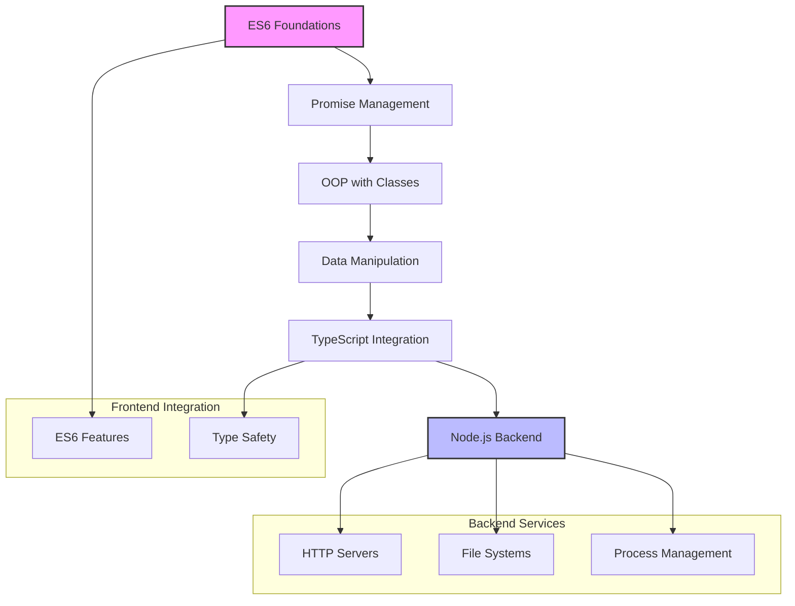
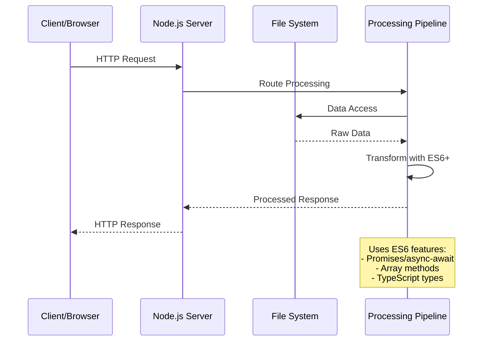
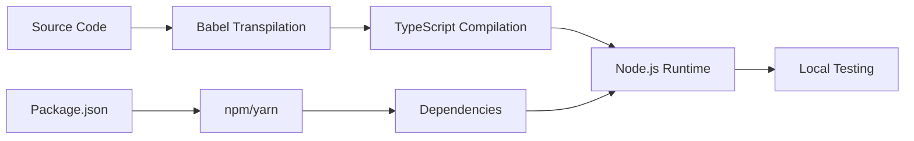

# 🏗️ System Architecture

## 📖 Overview
The ALX Backend JavaScript curriculum follows a progressive, modular architecture designed to build comprehensive backend development expertise. The system architecture emphasizes incremental learning, practical application, and real-world development patterns using modern JavaScript technologies.

---

## 🏛️ High-Level Architecture

The architecture progresses from fundamental JavaScript concepts to production-ready backend systems, ensuring each module builds upon previous knowledge while introducing new complexity and real-world applications.

---

## 🧩 Core Components

### ES6 Fundamentals Module
- **Purpose**: Establish modern JavaScript foundation with ES6+ features
- **Technology**: JavaScript ES6+, Babel transpilation
- **Location**: `./0x00-ES6_basic/`
- **Responsibilities**:
  - Arrow functions and lexical scoping
  - Template literals and string interpolation
  - Destructuring assignments and rest/spread operators
  - Block-scoped variable declarations (let/const)
  - Enhanced object literals and method definitions

### Promise & Async Module
- **Purpose**: Master asynchronous JavaScript programming patterns
- **Technology**: JavaScript Promises, async/await, error handling
- **Location**: `./0x01-ES6_promise/`
- **Responsibilities**:
  - Promise creation, chaining, and composition
  - Error handling with catch and finally
  - Async/await syntax and best practices
  - Concurrent execution with Promise.all/race/allSettled

### Object-Oriented Programming Module
- **Purpose**: Implement ES6 class-based object-oriented design
- **Technology**: ES6 Classes, inheritance, encapsulation
- **Location**: `./0x02-ES6_classes/`
- **Responsibilities**:
  - Class definitions and constructor patterns
  - Inheritance and method overriding
  - Static methods and properties
  - Encapsulation and access control
  - Polymorphism and interface design

### Data Manipulation Module
- **Purpose**: Advanced data processing with functional programming
- **Technology**: Array methods, Set/Map collections, functional patterns
- **Location**: `./0x03-ES6_data_manipulation/`
- **Responsibilities**:
  - Functional array methods (map, filter, reduce)
  - Set and Map data structures
  - Data transformation and aggregation
  - Performance optimization techniques

### TypeScript Integration Module
- **Purpose**: Type-safe JavaScript development and tooling
- **Technology**: TypeScript compiler, type definitions, interfaces
- **Location**: `./0x04-TypeScript/`
- **Responsibilities**:
  - Static type checking and inference
  - Interface design and implementation
  - Generic programming patterns
  - Module system and namespace management
  - Build tooling and compilation processes

### Node.js Backend Module
- **Purpose**: Server-side JavaScript and backend system development
- **Technology**: Node.js runtime, built-in modules, Express.js
- **Location**: `./0x05-Node_JS_basic/`
- **Responsibilities**:
  - HTTP server creation and request handling
  - File system operations and stream processing
  - Process management and environment configuration
  - Middleware patterns and request processing pipelines

---

## 📊 Data Flow Architecture

---

## 🔧 Design Patterns & Principles

### Modular Architecture
- **Separation of Concerns**: Each module focuses on specific competencies
- **Progressive Complexity**: Incremental difficulty and concept introduction
- **Practical Application**: Real-world scenarios and use cases

### Functional Programming Integration
- **Immutability**: Emphasis on pure functions and immutable data
- **Composition**: Function composition and higher-order functions
- **Declarative Style**: Focus on what to do rather than how to do it

### Object-Oriented Design
- **Encapsulation**: Data hiding and interface design
- **Inheritance**: Code reuse and hierarchical relationships
- **Polymorphism**: Interface uniformity and flexible implementations

### Asynchronous Patterns
- **Promise-Based**: Modern async handling with Promises
- **Error Handling**: Comprehensive error management strategies
- **Concurrent Processing**: Parallel execution and coordination

---

## 🚀 Deployment Architecture

### Development Environment

### Production Considerations
- **Runtime Environment**: Node.js LTS versions for stability
- **Process Management**: PM2 or similar for production deployments
- **Memory Management**: Efficient memory usage and garbage collection
- **Error Handling**: Comprehensive logging and error tracking
- **Performance Monitoring**: Application performance metrics

---

## 🔒 Security Architecture

### Code Security
- **Input Validation**: Comprehensive parameter and data validation
- **Error Handling**: Secure error messages without information leakage
- **Dependency Management**: Regular security updates and vulnerability scanning

### Runtime Security
- **Environment Variables**: Secure configuration management
- **Process Isolation**: Secure process execution and resource limits
- **File System Access**: Restricted file operations and path validation

---

## 📈 Performance Architecture

### Optimization Strategies
- **Asynchronous Operations**: Non-blocking I/O and concurrent processing
- **Memory Efficiency**: Efficient data structures and garbage collection
- **Code Splitting**: Modular loading and lazy evaluation
- **Caching Strategies**: In-memory and persistent caching approaches

### Monitoring & Metrics
- **Performance Profiling**: CPU and memory usage tracking
- **Response Times**: Request/response latency monitoring
- **Error Rates**: Error frequency and pattern analysis
- **Resource Utilization**: System resource consumption tracking

---

## 🧪 Testing Architecture

### Test Strategy
- **Unit Testing**: Individual function and class testing
- **Integration Testing**: Module interaction and API testing
- **End-to-End Testing**: Complete workflow validation
- **Performance Testing**: Load and stress testing capabilities

### Test Tools & Frameworks
- **Jest/Mocha**: JavaScript testing frameworks
- **Supertest**: HTTP assertion library
- **ESLint**: Code quality and style enforcement
- **Coverage Tools**: Code coverage analysis and reporting

---

## 🔄 Maintenance & Evolution

### Code Maintenance
- **Version Control**: Git-based development workflow
- **Code Reviews**: Peer review and quality assurance
- **Documentation**: Comprehensive code and API documentation
- **Refactoring**: Continuous code improvement and modernization

### Technology Evolution
- **ECMAScript Updates**: Adoption of new JavaScript features
- **Node.js Versions**: Runtime updates and compatibility management
- **TypeScript Evolution**: Type system enhancements and tooling updates
- **Framework Updates**: Express.js and related framework updates

---

*This architecture supports the ALX curriculum's goal of producing industry-ready backend JavaScript developers with comprehensive skills in modern web development.*
